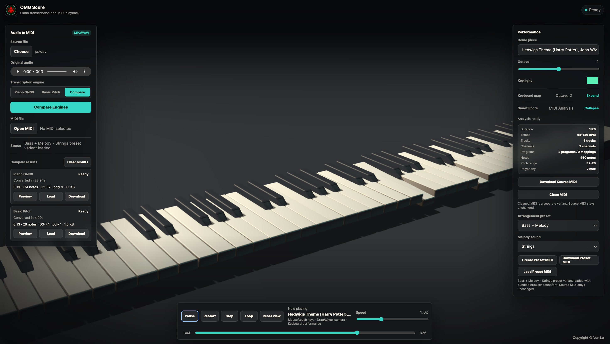

<p align="center">
  
  <br>
  <strong>Audio-to-MIDI transcription, browser playback, and Smart Score tools in one local-first studio.</strong>
</p>

<p align="center">
  English | <a href="./README.zh-CN.md">简体中文</a>
</p>

<p align="center">
  <a href="https://github.com/SleepyLGod/oh-my-score/actions/workflows/blank.yml"></a>
  <a href="https://github.com/SleepyLGod/oh-my-score/actions/workflows/backend.yml"></a>
  <a href="https://github.com/SleepyLGod/oh-my-score/actions/workflows/pages.yml"></a>
  <a href="https://github.com/SleepyLGod/oh-my-score/commits/main"></a>
  <a href="./LICENSE"></a>
</p>

<p align="center">
  
</p>

## Overview

OMG Score turns piano recordings and MIDI files into a playable, inspectable
browser workflow. It combines local audio-to-MIDI transcription, a 3D piano
player, MIDI analysis, cleanup/export tools, and simple arrangement sketches.

The project is built for local-first experimentation: the full stack runs
through Docker, while the static frontend can also be published as a GitHub
Pages demo for MIDI playback and UI exploration.

## What You Can Do

- Convert MP3/WAV audio into standard MIDI files.
- Choose Piano ONNX, Basic Pitch, or Compare mode for conversion.
- Preview, load, and download generated MIDI results.
- Inspect MIDI duration, tempo, tracks, channels, programs, notes, pitch range,
  and rough polyphony.
- Export source MIDI, conservatively cleaned MIDI, and General MIDI preset
  variants.
- Create lightweight Piano, Strings, Soft Synth, and Bass + Melody arrangement
  sketches.
- Play MIDI in a 3D piano studio with animated keys, timeline seek, loop, speed
  control, mouse/touch input, and keyboard performance.

## Why OMG Score

- Local-first: audio conversion runs on your machine instead of a hosted service.
- Docker-isolated: no host Node, Java, Maven, or FFmpeg install is required.
- Transparent: converted MIDI stays downloadable and reusable in MuseScore, DAWs,
  and other MIDI editors.
- User-choice workflow: Compare mode is for listening and inspection; OMG Score
  does not rank engines or select a result automatically.

## GitHub Pages Demo

```text
https://sleepylgod.github.io/oh-my-score/
```

The Pages workflow publishes [`apps/piano-player`](./apps/piano-player/).
Static hosting supports MIDI playback and the 3D piano UI. Audio-to-MIDI
conversion requires the local Docker backend.

## Isolated Local Run

Runtime caches, the ONNX model, and generated files stay under `.isolation/`.

```bash
mkdir -p .isolation/models
curl -L -o .isolation/models/transcription.onnx \
  https://github.com/EveElseIf/pianotranscription_java/releases/download/blob/transcription.onnx
docker compose up --build
```

Open the frontend:

```text
http://localhost:8080
```

The backend API listens on:

```text
http://localhost:8084
```

Stop the services:

```bash
docker compose down
```

If conversion fails with a missing model error, confirm that
`.isolation/models/transcription.onnx` exists before starting Compose.

## Current Status

- Audio transcription: MP3/WAV upload, async jobs, Piano ONNX, Basic Pitch, and
  Compare mode are implemented.
- Browser playback: local MIDI open, 3D piano animation, timeline seek, loop,
  speed control, and interactive performance input are implemented.
- Smart Score tools: MIDI analysis, source export, conservative cleanup, preset
  variants, and Bass + Melody sketches are implemented.
- Development workflow: Docker isolation, frontend CI, backend CI, and GitHub
  Pages deploy are configured.

See [`docs/TODO.md`](./docs/TODO.md) for the detailed Smart Score roadmap and
optional future backlog. See [`docs/DEVELOPMENT.md`](./docs/DEVELOPMENT.md) for
the local verification and pre-commit review checklist.

## Repository Layout

```text
apps/
  piano-player/       Static 3D piano frontend
  transcription-api/  Spring Boot audio-to-MIDI backend
  basic-pitch-service Docker-internal Basic Pitch sidecar
packages/
  midi-player/        JavaScript MIDI parser/player package
docs/
  assets/             README and documentation images
experiments/
  basic-pitch/        Docker-only Basic Pitch prototype
  engine-eval/        Local engine comparison utility
```

## API

- `GET /transcription/health` returns backend health.
- `POST /transcription/audioToMidiWithFile` accepts `multipart/form-data` with
  an MP3 or WAV `file` field and returns a generated `.mid` file.
- `POST /transcription/mp3ToMidiWithFile` is kept as a compatibility alias.
- `POST /transcription/jobs` starts an async MP3/WAV conversion job. Optional
  `engine` values are `piano-onnx` and `basic-pitch`; omitted values use
  `piano-onnx`.
- `GET /transcription/jobs/{id}` returns queued, running, succeeded, or failed
  status for a conversion job.
- `GET /transcription/jobs/{id}/midi` downloads the generated MIDI for a job in
  the succeeded state.

## Tech Stack

- Three.js
- MIDI.js
- Spring Boot
- Maven
- FFmpeg
- ONNX Runtime
- Basic Pitch sidecar service

## Attribution

Preset browser playback uses selected FluidR3 General MIDI soundfont assets from
[`gleitz/midi-js-soundfonts`](https://github.com/gleitz/midi-js-soundfonts).
See [`docs/ATTRIBUTIONS.md`](./docs/ATTRIBUTIONS.md).
