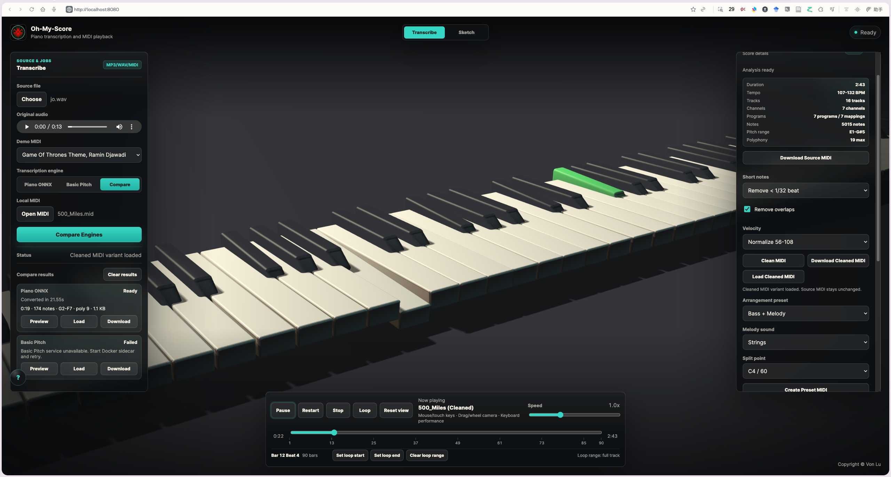
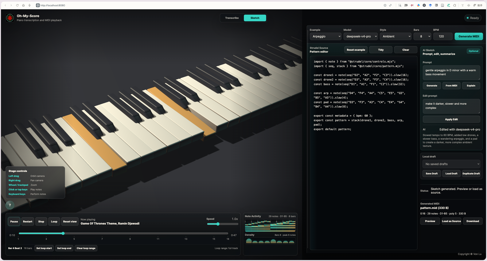

<p align="center">
  
  <br>
  <strong>本地优先的音乐工作室：音频转 MIDI、浏览器播放和 Smart Score 工具。</strong>
</p>

<p align="center">
  <a href="./README.md">English</a> | 简体中文
</p>

<p align="center">
  <a href="https://github.com/SleepyLGod/oh-my-score/actions/workflows/blank.yml"></a>
  <a href="https://github.com/SleepyLGod/oh-my-score/actions/workflows/backend.yml"></a>
  <a href="https://github.com/SleepyLGod/oh-my-score/actions/workflows/pages.yml"></a>
  <a href="https://github.com/SleepyLGod/oh-my-score/commits/main"></a>
  <a href="./LICENSE"></a>
</p>

<table>
  <tr>
    <td width="50%" align="center">
      
      <br>
      <sub>转录音频或 MIDI，对比引擎，并检查 Smart Score 结果。</sub>
    </td>
    <td width="50%" align="center">
      
      <br>
      <sub>编写 Strudel 代码、使用 AI 编辑、预览 MIDI，并查看音符活动。</sub>
    </td>
  </tr>
</table>

## 概览

Oh-My-Score 可以把钢琴录音和 MIDI 文件接入一个可播放、可检查的浏览器工作流。它把本地音频转 MIDI、3D 钢琴播放器、MIDI 分析、清理/导出工具和轻量编配草稿整合在一起。

这个项目面向本地优先的音乐实验：完整栈通过 Docker 运行；静态前端也可以发布到 GitHub Pages，用于 MIDI 播放和界面体验。

## 适合谁

Oh-My-Score 适合希望在本地获得可检查 MIDI 工作流的用户，包括：

- 希望把练琴录音转换成可播放 MIDI、方便复盘的钢琴学习者。
- 喜欢检查、清理、改编和导出 MIDI 文件的 MIDI 爱好者。
- 希望把可下载 MIDI 继续放进现有工具中编辑的 DAW 和 MuseScore 用户。
- 想在 Docker 隔离环境中实验转录、草稿 (sketching) 和可选 AI 模式草稿的本地 AI/音乐工具实验者。
- 正在评估转录引擎 (transcription engines)，并希望通过试听、加载和检查生成 MIDI 来比较输出的开发者。

## 当前限制

- 音频转 MIDI (Audio-to-MIDI) 转录的质量取决于录音质量、复音复杂度、背景噪声、乐器清晰度，以及所选模型或引擎的能力。
- 对比模式 (Compare mode) 只帮助你并排试听和检查多个引擎输出；它不会自动评判哪个引擎更好，也不会替你选择胜出者 (winner)。
- 智能乐谱 (Smart Score) 清理和预设 (presets) 是用于分析、清理和快速生成 General MIDI 变体的保守 MIDI 工具；它们不是完整乐谱排版系统，也不是专业配器 (orchestration) 工具。

## 你可以做什么

- 将 MP3/WAV 音频转换成标准 MIDI 文件。
- 在 Piano ONNX、Basic Pitch 和 Compare mode 之间选择转换方式。
- 试听、加载并下载生成的 MIDI 结果。
- 查看 MIDI 的 duration、tempo、tracks、channels、programs、notes、pitch range 和 rough polyphony。
- 导出 source MIDI、保守清理后的 cleaned MIDI，以及 General MIDI preset 变体。
- 创建轻量的 Piano、Strings、Soft Synth 和 Bass + Melody 编配草稿。
- 从 Strudel-style pattern code 生成固定长度的 code-to-MIDI 草稿，或可选地让配置好的 AI 模型生成可编辑的 pattern 草稿。
- 在 3D 钢琴工作室中播放 MIDI，支持琴键动画、timeline seek、loop、speed control、鼠标/触摸输入和键盘演奏。

## 为什么选择 Oh-My-Score

- 本地优先：音频转换在你的机器上运行，不依赖托管服务。
- Docker 隔离：不需要在宿主机安装 Node、Java、Maven 或 FFmpeg。
- 透明可控：转换后的 MIDI 可以下载，并继续放进 MuseScore、DAW 或其他 MIDI 编辑器。
- 用户自己选择：Compare mode 用于试听和检查；Oh-My-Score 不会给引擎排名，也不会自动替你选择结果。

## GitHub Pages Demo

```text
https://sleepylgod.github.io/oh-my-score/
```

Pages workflow 会发布 [`apps/piano-player`](./apps/piano-player/)。
静态托管支持 demo MIDI 播放、打开本地 MIDI、Smart Score 分析/清理、preset 导出和 3D 钢琴 UI；音频转 MIDI 仍需要本地 Docker backend。

## 静态 Demo vs 本地 Studio

GitHub Pages 和 Vercel 会把 Oh-My-Score 作为静态前端预览运行。托管静态页面支持 demo MIDI playback、local MIDI opening、Smart Score analysis、timeline review、cleanup，以及对已加载 MIDI 的 preset exports。

音频转录、Basic Pitch、Compare mode、Strudel MIDI generation 和 AI Sketch 需要本地 Docker 服务。需要完整工作流时，请用 `docker compose up --build` 启动本地 studio。

## 隔离本地运行

运行缓存、ONNX 模型和生成文件都会放在 `.isolation/` 下。

```bash
mkdir -p .isolation/models
curl -L -o .isolation/models/transcription.onnx \
  https://github.com/EveElseIf/pianotranscription_java/releases/download/blob/transcription.onnx
docker compose up --build
```

打开前端：

```text
http://localhost:8080
```

后端 API 地址：

```text
http://localhost:8084
```

Strudel sketch service 地址：

```text
http://localhost:8091
```

可选 AI sketch service 地址：

```text
http://localhost:8092
```

要启用 AI 生成的 Strudel 草稿，请把 [`.env.example`](./.env.example) 复制为 `.env`，并至少设置一个模型密钥。`DEEPSEEK_API_KEY` 用于 `deepseek-v4-pro`；`XIAOMI_API_KEY` 用于 `mimo-v2.5-pro`（`MIMO_API_KEY` 也可作为兼容别名）。前端不会收到这些密钥；Docker sidecar 会在本地通过兼容 OpenAI 的 Chat Completions 转发所选模型。

如果页面已运行但 AI Sketch 提示 service unavailable，请执行 `docker compose up -d ai-sketch-service` 启动 sidecar 后重试。

MiMo Token Plan 密钥以 `tp-` 开头，应设置 `MIMO_BASE_URL=https://token-plan-cn.xiaomimimo.com/v1`。Pay-as-you-go 密钥以 `sk-` 开头，应使用小米控制台提供的 pay-as-you-go base URL。

Sketch mode 会在 Docker sidecar 中执行用户提供的 Strudel JavaScript，而不是在主前端 bundle 中执行。服务只接受配置过的 frontend origins，会对生成请求进行限流，在导出前进行语法检查，并在 60 秒后终止导出。若要用于共享部署，请在把服务暴露到 localhost 之外以前先增加 Docker CPU 和内存限制。

停止服务：

```bash
docker compose down
```

如果转换时报缺少模型，请先确认 `.isolation/models/transcription.onnx` 存在，再启动 Compose。

## 当前状态

- 音频转录：已支持 MP3/WAV 上传、异步任务、Piano ONNX、Basic Pitch 和 Compare mode。
- 浏览器播放：已支持打开本地 MIDI、3D 钢琴动画、timeline seek、bar/beat review、loop ranges、speed control 和交互式演奏输入。
- Smart Score 工具：已支持 MIDI 分析、source export、保守 cleanup、preset variants、cleanup controls 和可配置的 Bass + Melody sketches。
- Sketch mode：已通过 Docker-isolated sidecar 实现 docked code-to-MIDI IDE、固定长度 Strudel pattern export、example patterns、本地 draft controls、MIDI preview、source load、download 和 generated note activity。
- 可选 AI Sketch：配置对应的本地 API key 后，`deepseek-v4-pro` 和 `mimo-v2.5-pro` 可以生成可编辑的 Strudel pattern 草稿。同一个本地 sidecar 可以把当前 MIDI 解释、编辑或总结为 Strudel 代码，但不会自动生成 MIDI。MiMo 内部使用 compact sketch-spec builder 来提升可靠性。
- 开发工作流：已配置 Docker 隔离、frontend CI、backend CI 和 GitHub Pages deploy。

详见 [`docs/TODO.md`](./docs/TODO.md) 中的 Smart Score roadmap 和可选后续 backlog。开发验证和提交前检查见 [`docs/DEVELOPMENT.md`](./docs/DEVELOPMENT.md)。

## 仓库结构

```text
apps/
  piano-player/       静态 3D 钢琴前端
  transcription-api/  Spring Boot 音频转 MIDI 后端
  basic-pitch-service Docker 内部 Basic Pitch sidecar
  strudel-sketch-service Docker 隔离的 Strudel code-to-MIDI sidecar
  ai-sketch-service   可选 AI prompt-to-Strudel sidecar
packages/
  midi-player/        JavaScript MIDI parser/player package
docs/
  assets/             README 和文档图片
experiments/
  basic-pitch/        Docker-only Basic Pitch prototype
  engine-eval/        本地 engine comparison 工具
```

## API

- `GET /transcription/health` 返回后端健康状态。
- `POST /transcription/audioToMidiWithFile` 接收带有 MP3 或 WAV `file` 字段的 `multipart/form-data`，并返回生成的 `.mid` 文件。
- `POST /transcription/mp3ToMidiWithFile` 保留为兼容别名。
- `POST /transcription/jobs` 启动异步 MP3/WAV 转换任务。可选 `engine` 值为 `piano-onnx` 和 `basic-pitch`；省略时使用 `piano-onnx`。
- `GET /transcription/jobs/{id}` 返回转换任务的 queued、running、succeeded 或 failed 状态。
- `GET /transcription/jobs/{id}/midi` 下载 succeeded 状态任务生成的 MIDI。

## 技术栈

- Three.js
- MIDI.js
- Spring Boot
- Maven
- FFmpeg
- ONNX Runtime
- Basic Pitch sidecar service
- Strudel sketch sidecar service
- OpenAI-compatible AI sketch sidecar

## Attribution

Preset browser playback 使用来自 [`gleitz/midi-js-soundfonts`](https://github.com/gleitz/midi-js-soundfonts) 的 selected FluidR3 General MIDI soundfont assets。
详见 [`docs/ATTRIBUTIONS.md`](./docs/ATTRIBUTIONS.md)。
