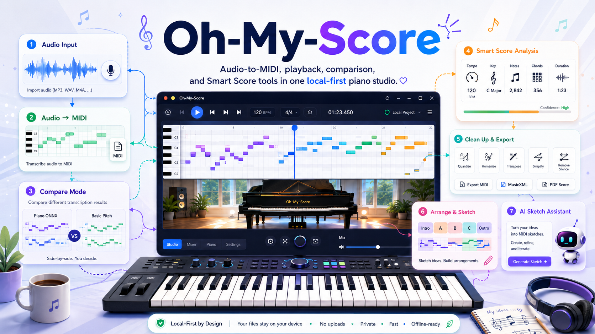

<p align="center">
  
</p>

<h1 align="center">Oh-My-Score</h1>

<p align="center">
  <strong>本地优先的音乐工作台：音频转 MIDI、MIDI 复查、Smart Score 清理，以及 Strudel code-to-MIDI 草稿。</strong>
</p>

<p align="center">
  <a href="https://sleepylgod.github.io/oh-my-score/"><strong>体验静态预览</strong></a>
  ·
  <a href="#本地-studio-完整工作流"><strong>运行本地 Studio</strong></a>
  ·
  <a href="./README.md">English</a>
</p>

<p align="center">
  <a href="https://github.com/SleepyLGod/oh-my-score/actions/workflows/blank.yml"></a>
  <a href="https://github.com/SleepyLGod/oh-my-score/actions/workflows/backend.yml"></a>
  <a href="https://github.com/SleepyLGod/oh-my-score/actions/workflows/pages.yml"></a>
  <a href="https://github.com/SleepyLGod/oh-my-score/commits/main"></a>
  <a href="./LICENSE"></a>
</p>

<table>
  <tr>
    <td width="50%" align="center">
      
      <br>
      <strong>Transcribe 工作区</strong>
      <br>
      <sub>转换音频或打开 MIDI，对比转录引擎，检查 Smart Score 分析，清理并导出 MIDI 变体。</sub>
    </td>
    <td width="50%" align="center">
      
      <br>
      <strong>Sketch 工作区</strong>
      <br>
      <sub>编写 Strudel-style 代码，使用可选 AI 编辑，生成 MIDI，预览结果，并查看音符活动。</sub>
    </td>
  </tr>
</table>

## 概览

Oh-My-Score 把录音和 MIDI 文件接入一个可播放、可检查的浏览器工作流。它整合了音频转 MIDI、3D 钢琴播放器、MIDI 分析、保守清理/导出工具、简单 General MIDI 编配草稿，以及受 Strudel 启发的 code-to-MIDI 工作区。

这个项目刻意保持本地优先。完整工作流通过 Docker 运行，运行缓存、模型文件和生成结果都放在仓库内的 `.isolation/` 下。GitHub Pages 也提供静态预览，适合不启动后端时体验 MIDI 播放、Smart Score 检查和界面流程。

## 你可以做什么

### 转录与复查

- 把 MP3/WAV 录音转换成标准 MIDI 文件，并通过异步任务跟踪状态。
- 在本地运行时选择 `piano-onnx`、`basic-pitch` 或 Compare mode。
- 试听多个引擎输出，再决定加载哪一个 MIDI；应用不会给引擎排名，也不会自动替你选出结果。
- 直接在浏览器打开本地 MIDI 文件。
- 查看 duration、tempo、tracks、channels、programs、note count、pitch range 和 rough polyphony。
- 使用 timeline seek、bar/beat review、loop range 和 speed control 复查 MIDI。

### 清理、导出与编配草稿

- 下载 demo、local、converted 或 generated MIDI 的原始 source MIDI。
- 用保守的 short-note、duplicate-overlap 和 velocity controls 生成独立 cleaned MIDI 变体。
- 导出 Piano、Strings、Soft Synth、Bass + Melody 的 General MIDI preset 变体。
- 手动调整 Bass + Melody split point，而且不会覆盖 source MIDI。

### 用代码生成 MIDI 草稿

- 从可编辑的 Strudel-style JavaScript 生成固定长度 MIDI sketch。
- 在 docked Sketch 工作区使用 examples、local drafts、search、diagnostics 和 editor shortcuts。
- 把当前 source MIDI 总结成一个简化的 Strudel 草稿。
- 可选地让配置好的本地 AI 模型生成、解释、编辑或帮助修复 Strudel 代码。AI 输出仍然只是可编辑代码；生成 MIDI 永远需要用户显式点击。

## 体验方式

| 模式 | 适合场景 | 不需要 Docker 可用 | 需要本地 Docker |
| --- | --- | --- | --- |
| 静态预览 | 快速体验 UI、demo MIDI、本地 MIDI 播放、Smart Score 检查 | Demo MIDI、Open MIDI、playback、timeline、cleanup、presets | 音频转录、Compare mode、Strudel generation、AI Sketch |
| 本地 Studio | 完整转录和 code-to-MIDI 工作流 | 不适用 | Transcription backend、Basic Pitch sidecar、Strudel sidecar、可选 AI sidecar |

### 静态预览

打开 GitHub Pages demo：

```text
https://sleepylgod.github.io/oh-my-score/
```

静态托管发布的是 [`apps/piano-player`](./apps/piano-player/)。它可以播放 demo MIDI、打开本地 MIDI、显示 Smart Score 分析，并对已加载 MIDI 导出 cleanup/preset 变体。它不能在没有 Docker 服务的情况下运行本地音频转录、Basic Pitch、Compare mode、Strudel MIDI generation 或 AI Sketch。

### 本地 Studio 完整工作流

运行缓存、模型文件和生成结果都会放在 `.isolation/` 下。

```bash
mkdir -p .isolation/models
curl -L -o .isolation/models/transcription.onnx \
  https://github.com/EveElseIf/pianotranscription_java/releases/download/blob/transcription.onnx
docker compose up --build
```

打开本地 Studio：

```text
http://localhost:8080
```

本地服务：

| 服务 | 地址 | 用途 |
| --- | --- | --- |
| Frontend | `http://localhost:8080` | 3D 钢琴、Transcribe、Smart Score、Sketch UI |
| Transcription API | `http://localhost:8084` | 音频转 MIDI 任务和 MIDI 下载 |
| Strudel sketch service | `http://localhost:8091` | Docker 隔离的 code-to-MIDI 导出 |
| AI sketch service | `http://localhost:8092` | 可选的模型辅助 Strudel 草稿和编辑 |

停止服务：

```bash
docker compose down
```

如果转换时报缺少模型，请先确认 `.isolation/models/transcription.onnx` 存在，再启动 Compose。

## 可选 AI 设置

AI Sketch 是可选能力。要启用它，请把 [`.env.example`](./.env.example) 复制为 `.env`，并至少设置一个模型密钥：

- `DEEPSEEK_API_KEY` 启用 `deepseek-v4-pro`。
- `XIAOMI_API_KEY` 启用 `mimo-v2.5-pro`。
- `MIMO_API_KEY` 也可以作为兼容别名。

前端不会拿到这些密钥。Docker sidecar 会在本地通过 OpenAI-compatible Chat Completions 转发所选模型。

如果页面已经运行，但 AI Sketch 提示 service unavailable，可以单独启动 sidecar：

```bash
docker compose up -d ai-sketch-service
```

MiMo Token Plan 密钥以 `tp-` 开头，应使用：

```text
MIMO_BASE_URL=https://token-plan-cn.xiaomimimo.com/v1
```

Pay-as-you-go 密钥以 `sk-` 开头，应使用小米控制台提供的 pay-as-you-go base URL。

## 当前限制

- 音频转 MIDI 质量取决于录音质量、复音复杂度、背景噪声、乐器清晰度和所选引擎能力。
- Compare mode 是试听和检查工作流。它帮助你比较输出，但不会判断哪个引擎更好。
- Smart Score cleanup 和 presets 是保守 MIDI 工具，不是完整乐谱排版系统，也不是专业配器工具。
- Sketch mode 导出固定长度 MIDI 草稿。它不是完整 Strudel live coding REPL，也不支持任意 sample playback。
- 如果要把后端或 sidecar 服务暴露到 localhost 之外，应先增加 Docker CPU 和内存限制。

## 当前状态

- 音频转录：已支持 MP3/WAV 上传、异步任务、Piano ONNX、Basic Pitch 和 Compare mode。
- 浏览器播放：已支持打开本地 MIDI、3D 钢琴动画、timeline seek、bar/beat review、loop ranges、speed control 和交互式演奏输入。
- Smart Score 工具：已支持 MIDI 分析、source export、保守 cleanup、preset variants、cleanup controls 和可配置的 Bass + Melody sketches。
- Sketch mode：已通过 Docker-isolated services 实现 docked code-to-MIDI IDE、固定长度 Strudel pattern export、example patterns、本地 draft controls、MIDI preview、source load、download、editor diagnostics、contextual AI diagnostic fix 和 generated note activity。
- 可选 AI Sketch：配置对应的本地 API key 后，`deepseek-v4-pro` 和 `mimo-v2.5-pro` 可以生成可编辑 Strudel pattern 草稿。同一个本地 sidecar 可以解释、编辑，或把当前 MIDI 总结成 Strudel 代码，但不会自动生成 MIDI。
- 开发工作流：已配置 Docker 隔离、frontend CI、backend CI 和 GitHub Pages deploy。

详见 [`docs/TODO.md`](./docs/TODO.md) 中的 Smart Score roadmap 和可选后续 backlog。开发验证和提交前检查见 [`docs/DEVELOPMENT.md`](./docs/DEVELOPMENT.md)。

## 仓库结构

```text
apps/
  piano-player/       静态 3D 钢琴前端
  transcription-api/  Spring Boot 音频转 MIDI 后端
  basic-pitch-service Docker 内部 Basic Pitch sidecar
  strudel-sketch-service Docker 隔离的 Strudel code-to-MIDI sidecar
  ai-sketch-service   可选 AI prompt-to-Strudel sidecar
packages/
  midi-player/        JavaScript MIDI parser/player package
docs/
  assets/             README 和文档图片
experiments/
  basic-pitch/        Docker-only Basic Pitch prototype
  engine-eval/        本地 engine comparison 工具
```

## API

- `GET /transcription/health` 返回后端健康状态。
- `POST /transcription/audioToMidiWithFile` 接收带有 MP3 或 WAV `file` 字段的 `multipart/form-data`，并返回生成的 `.mid` 文件。
- `POST /transcription/mp3ToMidiWithFile` 保留为兼容别名。
- `POST /transcription/jobs` 启动异步 MP3/WAV 转换任务。可选 `engine` 值为 `piano-onnx` 和 `basic-pitch`；省略时使用 `piano-onnx`。
- `GET /transcription/jobs/{id}` 返回转换任务的 queued、running、succeeded 或 failed 状态。
- `GET /transcription/jobs/{id}/midi` 下载 succeeded 状态任务生成的 MIDI。

## 技术栈

- Three.js
- MIDI.js
- CodeMirror 5
- Spring Boot
- Maven
- FFmpeg
- ONNX Runtime
- Basic Pitch sidecar service
- Strudel sketch sidecar service
- OpenAI-compatible AI sketch sidecar

## Attribution

Preset browser playback 使用来自 [`gleitz/midi-js-soundfonts`](https://github.com/gleitz/midi-js-soundfonts) 的 selected FluidR3 General MIDI soundfont assets。
详见 [`docs/ATTRIBUTIONS.md`](./docs/ATTRIBUTIONS.md)。
